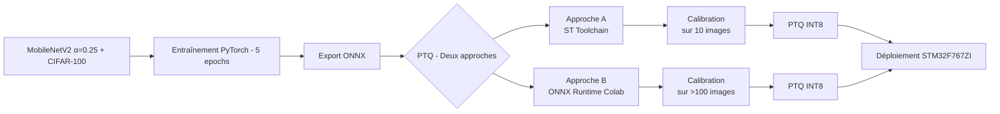
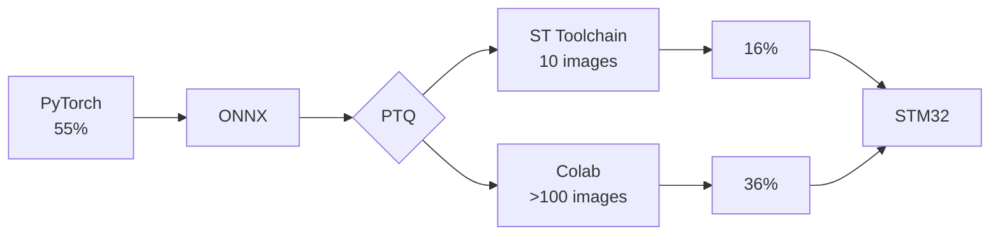

# STM32 Image Classification Project

## Project Overview

This project focuses on deploying an AI-based image classification model on an embedded system.
A **MobileNet model** is trained on the **CIFAR-100 dataset**, then exported to ONNX and optimized before being deployed on an STM32 microcontroller using STM32 AI tools.
The goal is to demonstrate the **full pipeline from training to embedded deployment**, including:

* Model training (PyTorch)
* ONNX export
* Quantization (INT8)
* Deployment on STM32

This project was developed as part of a **course project**.

---

## Repository Structure

###🔹Environment Setup

All installation and dependency files are located in:

```bash
conda_env/
```

This folder contains:

* `environment.yml`
* `requirements.txt`

Use these files to recreate the environment needed to run the project.

---

###🔹Model & Classification Code

The main code and image classification pipeline are located in the **image_classification folder**:

```bash
image_classification/
```

This includes:

* Model definition and export
* ONNX inference
* Quantization pipeline
* Evaluation scripts (accuracy, precision, recall, F1-score)
* README

---

### 🔹 STM32 Deployment

The embedded deployment code is located in:

```bash
STM32CubeIDE_code_c/
```

This contains the full STM32CubeIDE project used to run the model on hardware.

---

## Additional Information

All detailed explanations, design choices, and experimental results (including performance comparison between quantized and non-quantized models) are provided in the **project report**.

---

## Summary

* Model: MobileNet
* Dataset: CIFAR-100
* Frameworks: PyTorch → ONNX → STM32 AI
* Target: STM32 microcontroller
* Objective: End-to-end embedded AI deployment

---


## STM32_Model_Zoo_DataClassification_Project Pipeline


