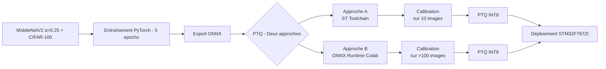
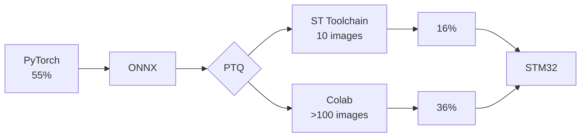

# STM32_Model_Zoo_DataClassification_Project

```mermaid
flowchart LR
    A[MobileNetV2 α=0.25 + CIFAR-100] --> B[Entraînement PyTorch - 5 epochs]
    B --> D[Export ONNX]
    D --> E{PTQ - Deux approches}
    
    E --> F[Approche A<br>ST Toolchain]
    E --> G[Approche B<br>ONNX Runtime Colab]
    
    F --> H[Calibration<br>sur 10 images]
    G --> I[Calibration<br>sur >100 images]
    
    H --> J[PTQ INT8]
    I --> K[PTQ INT8]
    
    J --> N[Déploiement STM32F767ZI]
    K --> N
```

```mermaid    
flowchart LR
    A[PyTorch<br>55%] --> B[ONNX]
    B --> C{PTQ}
    C --> D[ST Toolchain<br>10 images]
    C --> E[Colab<br>>100 images]
    D --> F[16%]
    E --> G[36%]
    F --> H[STM32]
    G --> H
```
